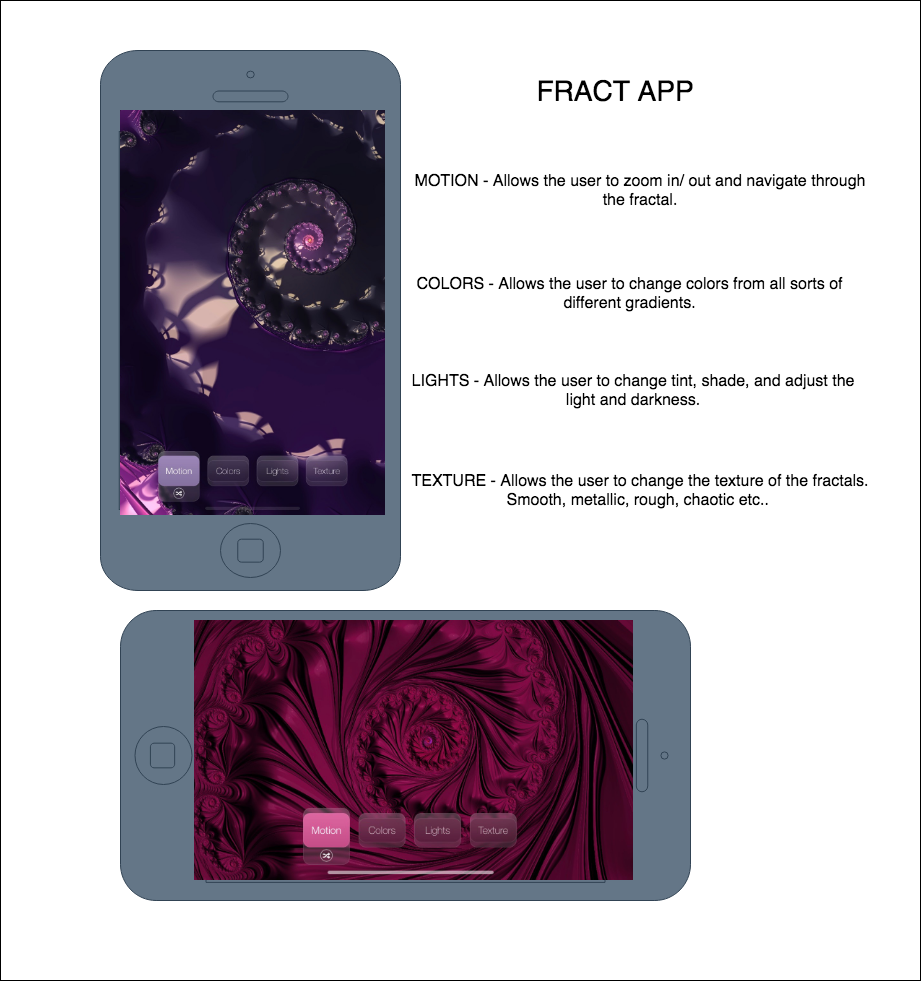

# FractApp

Answer the following questions about your proposed Android project; write your answers in the README.md file
of the Android project you created on Jan. 31. Be sure to commit and push after you modify README.md or add more files
(wireframes, user stories, etc.) to the project!

What will your app be called? 
The name of my application will be FractApp given that it creates, you guessed it. Fractals.

Why did you choose to develop this particular app? When I first saw the creations of the Mandelbrot set and Julie set and all the other fractals it looked very interesting and beautiful to make. The fact that you can continue to zoom in on the fractals and finding new and more intriquet designs the further you go it heavily inspired me to create one on my own. I find it a very peaceful and to be quite frank, pretty stress releiving.

A description of the current state of completion/readiness of your app. This should include a “hit list” of deficiencies: any unimplemented/incomplete elements, and known bugs, that would have to be implemented or corrected for a usable prototype, ordered with the most urgent items first? Well there was still quite a bit I needed to do to be able to say I'm done. I would have liked to completed the actual function of the application where you can phsycially zoom in/out on the mandelbrot display which would be #1 on my list. The following would come after such as a selection area that allows you to pick different fractal styles to make the experience more itriguing. I would have also liked to have completed a series of buttons on the main screen that change the motion, color, texture, and lighting type of the fractal. I have an app that displays an image of the Mandelbrot but does not do anything and I have added the buttons i was mentions to the main page but those as well do not do anything. Overall my app runs it just is about 50% away from completion.

A list of aesthetic/cosmetic (not functional) improvements that you think would improve your app. This list should be ordered, with those that would give the most improvement (in your opinion) listed first. I think my app looks pretty good cosmetically, the only thing I would have liked to change my buttons and make those see through to flow better with the fractal display.

A list of functional stretch goals. These should be sorted either with those that would add the most utility at the top, or with those that would be the simplest to implement at the top. 
1. Create a functioning fractal display.
2. Create the poinch to zoom function to explore the fractal.
3. Have functional buttons that do what they are supposed to.
4. Create a sharing fragment that allows the user to share their images.

What's the basic functionality of the app? The basic functionality of my Android app will draw multiple types of Fractal designs and allows you to zoom in and out to explore the intricacy of such creations. It has a responsive design with a multi-touch interface to explore intricate shapes and patterns. Also an interaction mode which allows the user to control color gradients and different sorts of textures that can change the display. 

Who would find this app useful or fun, and when would they use it? Anyone can download and use this app and find that it is very entertaining and a great way kill some time. It's entertaining eye catching design will mesmerize the user and capture them into an intricate world of never ending creations conisted of different dhapes and patterns.

Could this app be useful on its own, with no connection to the internet? Yes, although some features would require an internet connection the main purpose and fucntion of this app would not require any type of connection.

What sort of data would this app use or share if it had a connection to the internet? If connected to the internet the app will be able to pull andf share information regarding sharing their creation to a social media platform or downloading the file to a local drive or also saving it within a user profile implemented in the app. 

If this app will consume external data, investigate and list possible internet-based sources for this data.

# ERD
[ERD](TheRealERD.pdf)

# User Stories

* I'm just your day to day student, and when I always found myself having a little bit of extra time here and there I never quite knew what to do. I'd find myslef thinking so much about what to do I'd have already wasted all my extra time. Having downloaded the FractApp I've been able to efficiently kill time as well as being hands on and creating something so unique it such a little amount of time. 

* I'm a pretty stressed out person dealing with all my day to day duties and being responsible for so much I actually downloaded the FractApp which seemed to have helped me take off some stress and to remind me to take things slow and clear my mind from all the stress and it helps me relax.

# Documentation
For more details on current classes and methods, see [Javadoc](docs/api/)

# WireFrame

